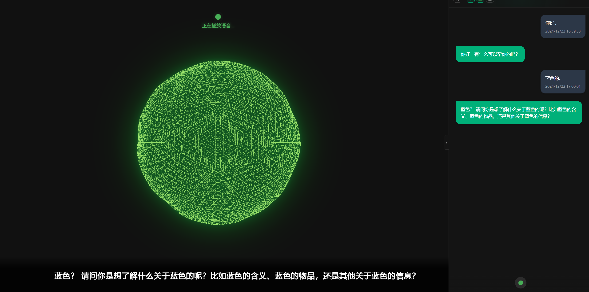

# AI 语音助手 | AI Voice Assistant

[English](./README.md) | [中文](./README_CN.md)




A web-based AI voice assistant that integrates speech recognition, AI conversation, and speech synthesis. Users can interact with AI through real-time voice conversations.

## Key Features

- Real-time speech recognition (based on Baidu Speech Service)
- AI conversation (powered by Gemini API)
- Text-to-Speech (TTS)
- Real-time audio visualization
- Automatic voice input detection
- Support for interruption and continuous dialogue

## Requirements

- Node.js 16.0 or above
- Modern browser (with WebAudio API support)
- Internet connection (for API calls)
- Python 3.7 or above
- edge-tts library (for speech synthesis)

## Quick Start

### 1. Install Dependencies

```bash
# Install pnpm globally (if not installed)
npm install -g pnpm

# Install project dependencies
pnpm install

# Backend dependencies
cd Backend
pip install -r requirements.txt
```

### 2. Start Backend Service

```bash
# Navigate to backend directory
cd Backend

# Start backend service
python edge-tts.py
```

> Note: The backend service must run on port 8000 for the speech synthesis feature to work properly.

### 3. Configure Environment Variables

1. Copy `.env.example` file and rename it to `.env`:
```bash
cp .env.example .env
```

2. Fill in your API keys in the `.env` file:

```plaintext
# Baidu API Configuration
BAIDU_API_KEY=your_baidu_api_key_here
BAIDU_SECRET_KEY=your_baidu_secret_key_here
BAIDU_TOKEN_URL=https://aip.baidubce.com/oauth/2.0/token
BAIDU_ASR_URL=https://vop.baidu.com/server_api

# Gemini API Configuration
GEMINI_API_KEY=your_gemini_api_key_here
GEMINI_API_URL=https://generativelanguage.googleapis.com/v1beta/models/gemini-1.5-flash:generateContent
```

### 4. Start Frontend Development Server

```bash
# Return to project root
cd ..

# Install frontend dependencies
pnpm install

# Start development server
pnpm dev
```

Visit `http://localhost:5173` to use the voice assistant.

> Tip: We recommend using pnpm as the package manager for faster installation and better disk space utilization.

## System Architecture

The project is divided into frontend and backend:

- Frontend: React + Vite web application
  - Speech recognition (Baidu Speech Service)
  - AI conversation (Gemini API)
  - Audio visualization

- Backend: Python Flask application
  - Speech synthesis service (based on edge-tts)
  - Running on port 8000

## Obtaining API Keys

### Baidu Speech Service
1. Visit [Baidu Cloud](https://cloud.baidu.com/)
2. Register/Login
3. Create a speech application
4. Get API Key and Secret Key

### Gemini API
1. Visit [Google AI Studio](https://makersuite.google.com/app/apikey)
2. Login with Google account
3. Create API key

## Security Notes

- Never commit `.env` file containing actual API keys to version control
- Ensure `.env` file is added to `.gitignore`
- Regularly rotate API keys
- Implement additional security measures for production environment

## Usage Guide

1. Open the webpage and allow browser microphone access
2. Wait for "Ready" prompt
3. Start speaking, the system will automatically detect voice input
4. AI assistant will respond through voice
5. You can interrupt AI's response at any time to continue asking questions

## Troubleshooting

1. If speech recognition is inaccurate, ensure:
   - Microphone is working properly
   - Environment noise is minimal
   - Speaking at a moderate pace

2. If API calls fail, check:
   - API keys are correct
   - Network connection is stable
   - API usage quotas are not exceeded

## Support

For issues or suggestions, please submit an Issue or Pull Request.

## License

MIT License

## Acknowledgments

This project references the following excellent open-source projects:

- [transformers.js-examples/moonshine-web](https://github.com/huggingface/transformers.js-examples/tree/main/moonshine-web) - HuggingFace's Transformers.js example project
- [edge-tts](https://github.com/lyz1810/edge-tts) - Microsoft Edge TTS-based online speech synthesis service
